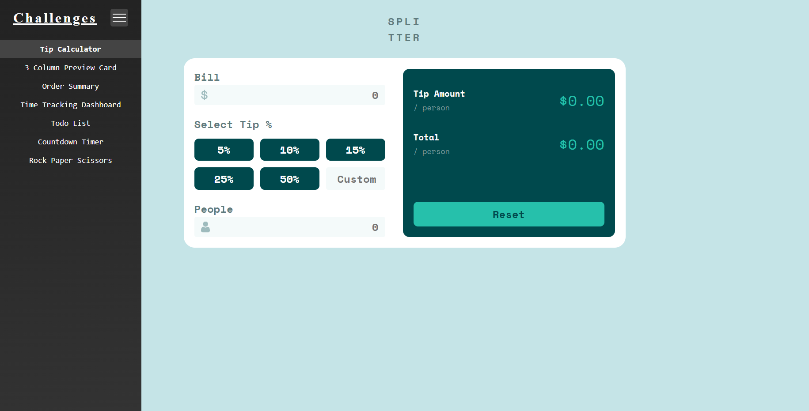
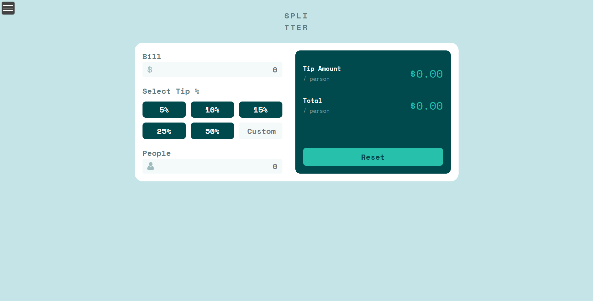
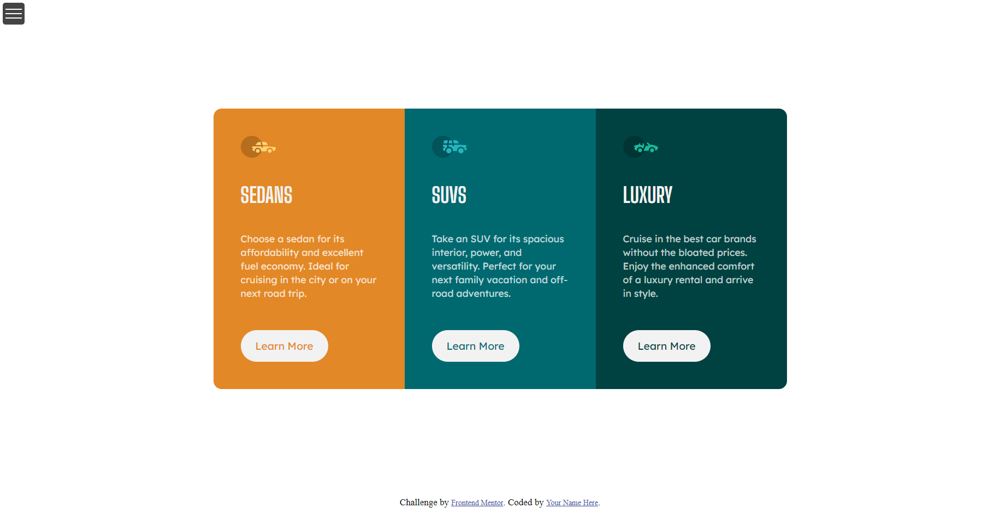
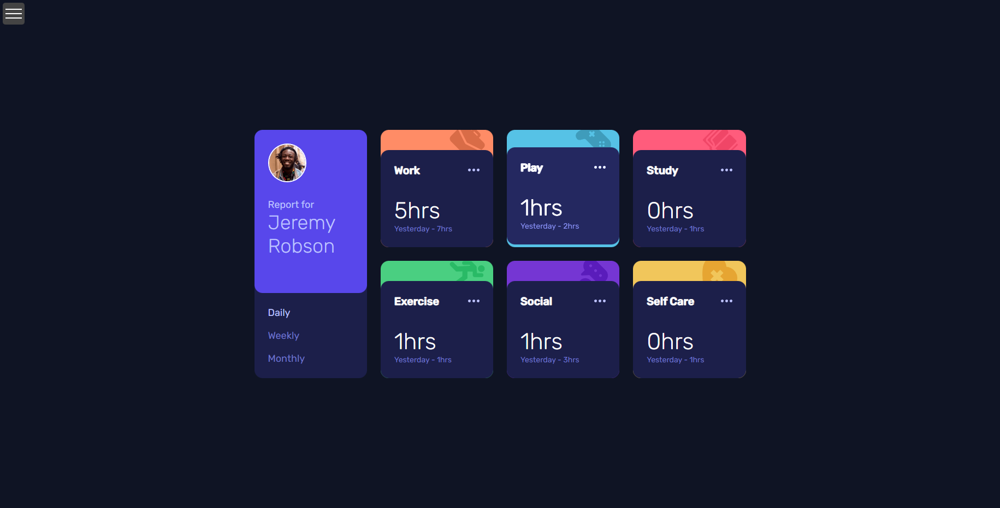
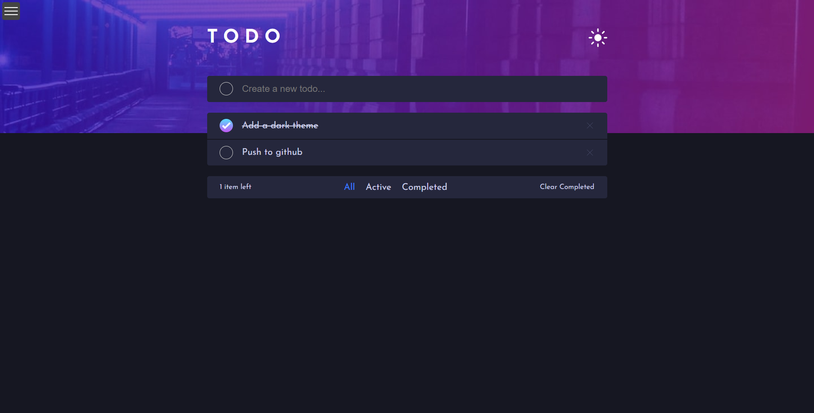
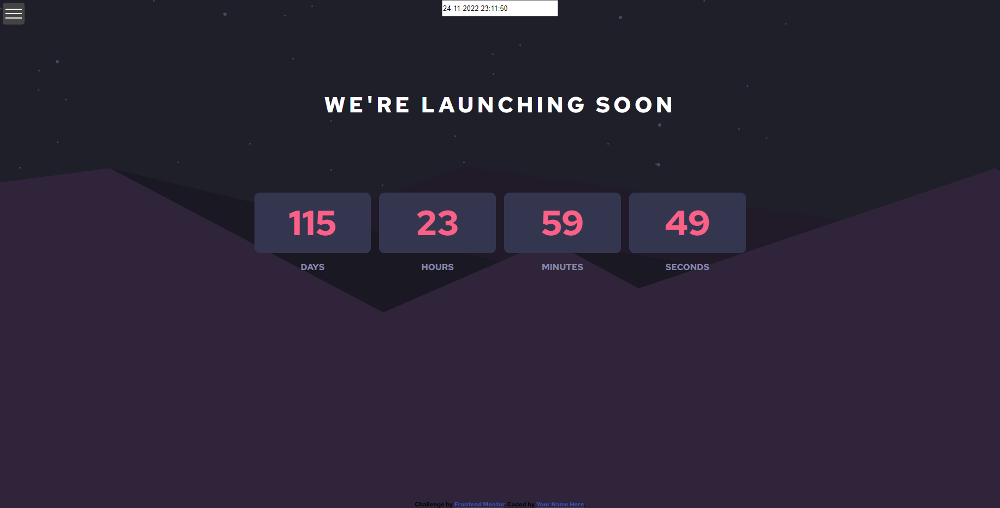
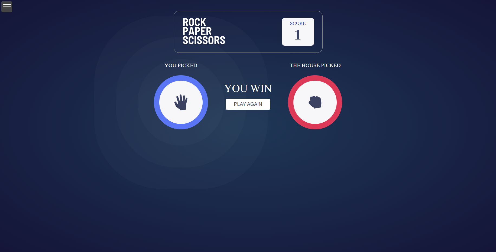

# Desafios Frontend

### Neste repositório estão alguns desafios que resolvi da plataforma frontend mentor

---

### Sidebar com os desafios

---

#### Splitter (app para calcular divisão de conta)

---

#### Design com 3 colunas

---

#### Sumário de compra

---

#### Dashboard de contagem de tempo gasto

---

#### Todo list

---

#### Contagem regressiva

---

#### Pedra papel tesoura

